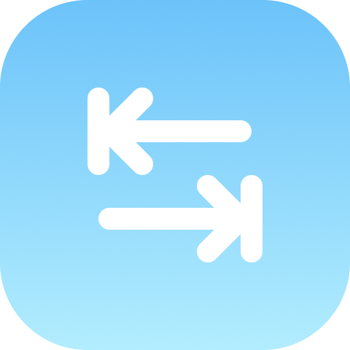

<h1 align="center">Renput</h1>
<h2 align="center">A simple Python library, which replaces the default input function in order to add the functionality to automatically complete an input using the tab key.</h2>

